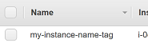

# aws4d - AWS 4 dummies

The AWS command line interface provides all of the functionality that the online console
does. The power can be overwhelming. These are some utilities that I wrote to make my life,
as a very simple AWS EC2 user, a bit easier.

As an EC2 user, I'll have a couple of instances hanging around in various states (running,
stopped). I think of these instances as each being identified by a "name tag" that I've
previously set in the AWS console. I prefer to work with these name tags rather than instance
IDS, but I also want to avoid the console as much as possible for simple tasks.



With these utilities, knowing the name tag of my instance, I can
- start and stop an instance
- get the public DNS address of an instance in order to ssh after a restart
- update the inbound rules of the security group associated with an instance in order to
    allow an SSH connection from my computer 
- connect to an instance in one fell swoop: restarting it if necessary, getting its public
    DNS address, allowing inbound connections from my current IP, and SSHing in

## Setup

First, install the `jq` json processor (ex. on Ubuntu):
```bash
sudo apt-get install jq
```

1. Install the AWS command line interface
   [here](http://docs.aws.amazon.com/cli/latest/userguide/installing.html).
2. Configure your client using the `aws configure` command, documented in more detail
   [here](http://docs.aws.amazon.com/cli/latest/userguide/cli-chap-getting-started.html#cli-quick-configuration).
   This will create config files in a directory `~/.aws`.
3. Source the utility:

    ```bash
    chmod u+x aws4d.sh
    ./aws4d.sh
    ```
   You may want to include this in your `bashrc` file:

    ```bash
    echo 'source ~/aws4d.sh 2>/dev/null' >> ~/.bashrc
    ```
4. Populate environment variables detailing your type of connection. You may want to also
   include these in a local `bashrc` file.

    ```bash
    export AWS_EC2_USER_NAME="ec2-user"
    export AWS_EC2_SSH_KEY="$HOME/.ssh/my-key.pem"
    ```
   The SSH connection will be made as 

    ```bash
    ssh -i ${AWS_EC2_SSH_KEY} ${AWS_EC2_USER_NAME}@public-dns-determined-automatically.com
    ```
   The user name could certainly be inferred from the type of system automatically, I haven't
   done that yet.

## Usage

You want to use the function `connect_to_instance`:
```bash
$ connect_to_instance my-instance-name-tag
Getting security group id for instance name: my-instance-name-tag
Revoking existing ssh access for cidr: 1.2.3.4/32
Authorizing new ssh access for cidr: 5.6.7.8/32
Connecting to ec2-user@ec2-255-254-253-252.us-west-2.compute.amazonaws.com
```

This function takes one argument which is the name tag of the instance. It gets the instance
ID from the name tag, and restarts the instance if it is not running. It revokes all
outstanding inbound SSH access for the security group associated with the instance, then
authorizes the current machine for inbound SSH connections. Finally, after confirming the
instance has started, the public DNS address is determined and an SSH connection is made.

You can also use the function `stop_instance` after you finish with an instance for the
moment:
```bash
$ stop_instance my-instance-name-tag
Stopping instance: i-abcdef01234567890
{
    "StoppingInstances": [
        {
            "InstanceId": "i-abcdef01234567890",
            "PreviousState": {
                "Name": "running",
                "Code": 16
            },
            "CurrentState": {
                "Name": "stopping",
                "Code": 64
            }
        }
    ]
}
```

## Further Development

I've got nothing more planned for this, but you're welcome to submit bugs/PRs.
